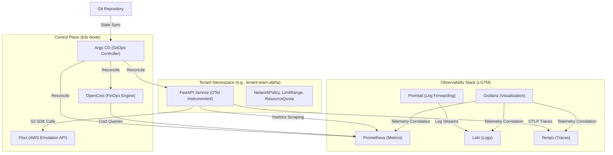

<div align="center">
    
# FrugalZeus⚜️

## Cloud-Native Engineering  Platform 

  
&nbsp;


[](https://k3s.io/) [](https://grafana.com/) [](https://www.opencost.io/)
</div>

**FrugalZeus** is a sovereign, zero-idle-waste Internal Developer Platform (IDP) . It demonstrates an end-to-end GitOps delivery pipeline, localized cloud IaC emulation, unified OpenTelemetry observability, and granular sub-namespace FinOps cost attribution—all orchestrated on any Kubernetes Cluster

---

## Architecture Topology

The platform enforces strict declarative state management, leveraging Argo CD's App-of-Apps pattern to synchronize infrastructure capabilities and tenant workloads.



---

## Technical Stack & Design Decisions

| Capability | Component | Architectural Justification |
| :--- | :--- | :--- |
| **Orchestration** | **k3s** | Minimal footprint Kubernetes distribution; eliminates control-plane bloat for local emulation. |
| **GitOps** | **Argo CD** | Pull-based state reconciliation. Utilizes `sync-waves` for deterministic infrastructure bootstrapping before tenant workload injection. |
| **Cloud Emulation** | **Floci** | In-cluster, low-memory AWS API emulator. Allows isolated, zero-cost IaC execution (Terraform) and application SDK testing without external cloud dependencies. |
| **Observability** | **LGTM Stack** | Unified telemetry. OpenTelemetry auto-instrumentation exposes metrics (Prometheus) and traces (Tempo), correlated seamlessly in Grafana. |
| **FinOps** | **OpenCost** | Real-time, in-cluster cost allocation based on Prometheus telemetry. Enables strict showback/chargeback per tenant namespace. |
| **Tenancy** | **Kustomize** | Enforces least-privilege guardrails. Base overlays ensure immutable injection of `NetworkPolicy`, `ResourceQuota`, and `LimitRange` per tenant. |

---

## Platform Bootstrapping

The bootstrap process supports both existing Kubernetes clusters and automated k3s provisioning.

```bash
# 1. Clone the repository
git clone https://github.com/barbaria888/FrugalZeus.git
cd FrugalZeus

# 2. Execute platform orchestration
# Prompts for cluster targeting; automatically configures Argo CD insecure mode and NodePort ingress.
make bootstrap

# 3. Access Platform Interfaces
# The bootstrap process exposes the following interfaces via Traefik/NodePorts:
#   Grafana:   http://localhost:30000 (admin / platform-admin)
#   Argo CD:   http://localhost:30080 (admin / <auto-generated-password>)
#   Tenant UI: http://localhost:30800
#   OpenCost:  http://localhost:30903
make ports

# 4. Execute validation suite
make test
```

---

## Developer Operations

```bash
make help       # Discover available automation targets
make bootstrap  # Idempotent platform instantiation (k3s, Argo CD, Floci, Terraform)
make ports      # Fallback local port-forwarding for core UI endpoints
make status     # Output cluster health, Argo CD synchronization state, and pod lifecycle
make test       # Execute endpoint smoke tests against tenant workloads
make password   # Retrieve the Argo CD initial admin credential
make clean      # Destructive teardown of local k3s topology
```
