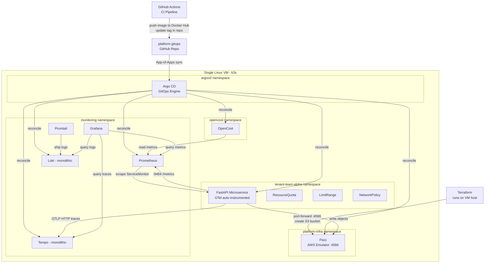

# FrugalZeus — Cloud-Native Platform Engineering & FinOps

[](https://argoproj.github.io/cd/)
[](https://www.terraform.io/)
[](https://k3s.io/)
[](https://grafana.com/)
[](https://www.opencost.io/)

> **FrugalZeus**: Sovereign platform authority with zero idle waste. A lightweight, multi-tenant Internal Developer Platform demonstrating end-to-end GitOps delivery, local cloud IaC simulation, unified OpenTelemetry observability, and sub-namespace FinOps cost attribution on a single Linux VM.

---

## Architectural Stack

| Layer | Tooling | Purpose |
| --- | --- | --- |
| **Cluster Runtime** | k3s on single Linux VM | Lightweight Kubernetes control plane and worker node. |
| **Infrastructure as Code** | Terraform | Provisions simulated AWS infrastructure (S3) against Floci. |
| **Cloud Simulation** | Floci | Low-memory AWS API emulator running inside the cluster. |
| **GitOps Engine** | Argo CD | Declarative GitOps reconciliation using the App-of-Apps pattern. |
| **CI Automation** | GitHub Actions | Builds Docker images and updates manifest tags in GitOps repo. |
| **Observability** | Prometheus + Loki + Tempo + Grafana | Metrics, logs, traces unified under OpenTelemetry. |
| **FinOps** | OpenCost | In-cluster compute cost allocation and spend attribution per namespace. |
| **Developer Portal** | MkDocs (Material) | Self-service docs hosted on GitHub Pages (zero cluster RAM). |

---

## Quick Start

```bash
# 1. Clone the repository
git clone https://github.com/barbaria888/FrugalZeus.git
cd FrugalZeus

# 2. Bootstrap the entire platform
make bootstrap

# 3. Open developer port-forwards
make ports

# 4. Run endpoint smoke tests
make test
```

---

## Architecture Diagram



---

## Developer Commands

```bash
make help       # List available make commands
make bootstrap  # Install k3s, Argo CD, Floci, apply Terraform
make ports      # Port-forward Grafana, Argo CD, App, OpenCost
make status     # Show nodes, Argo CD applications, and pod status
make test       # Smoke test /health, /upload, /list, /metrics
make password   # Output Argo CD initial admin password
make clean      # Uninstall k3s completely
```
---

## How to Use FrugalZeus
Now that your repository is fully pushed to GitHub (https://github.com/barbaria888/FrugalZeus.git) and all templates are updated to target your repository URL, here is how you can use, run, and present it:

Step 1: Configure GitHub Actions Secrets
Since you transitioned the container registry to Docker Hub, you need to add your credentials to the GitHub Repository Secrets so the CI pipeline can push built images.

Go to your GitHub repository: https://github.com/barbaria888/FrugalZeus.
Navigate to Settings → Secrets and variables → Actions.
Click New repository secret and add:
DOCKERHUB_USERNAME: Your Docker Hub username (hardik0811)
DOCKERHUB_TOKEN: A personal access token generated from your Docker Hub account settings (Security → New Access Token).
Step 2: Bootstrap the Entire Platform
SSH into your Linux VM/environment, clone the repository, and run the single bootstrap command:

```bash
# 1. Clone the repository
git clone https://github.com/barbaria888/FrugalZeus.git
cd FrugalZeus
```
# 2. Setup k3s, Argo CD, Floci, and provision S3 resources via Terraform
```
make bootstrap
```
> What this does: It installs k3s, installs Argo CD, applies the root App-of-Apps manifest, waits for Floci (AWS simulator) to become healthy, port-forwards Floci to the host, and executes terraform apply to provision the S3 bucket.

#  3: Run Port-Forwards & Access Services
Open all service interfaces locally using a single command:

```bash
make ports
```
This will forward and output the URLs to access:
```
Grafana (Observability Dashboard): http://localhost:3000 (User: admin / Password: platform-admin)
Argo CD (GitOps Status): https://localhost:8080 (User: admin / Password: can be retrieved with make password)
FastAPI Application: http://localhost:8000
OpenCost (Cost Allocation Dashboard): http://localhost:9003
```

## 4: Smoke Test the System
To verify that everything is running correctly, run:

```bash
make test
```
This tests:
- /health on the FastAPI microservice.
- /upload to write an object to the emulated S3 bucket (Floci).
- /list to read back the objects from the bucket.
- /metrics to ensure the unified OpenTelemetry exporter is emitting Prometheus-formatted metrics on port 9464.
## 5: Explore Logs & Traces in Grafana
Navigate to Grafana (http://localhost:3000) and explore the telemetry signals:
<div align="center">
Metrics: Query Prometheus using the metric: http_server_request_duration_seconds_bucket{service_name="team-alpha-svc"}.
Logs: Query Loki ({namespace="tenant-team-alpha"}) to inspect the real-time container output.
Traces: Go to Explore → select Tempo → Search. You'll see distributed trace waterfalls showing incoming HTTP requests alongside subsequent S3 client operations.
</div>
