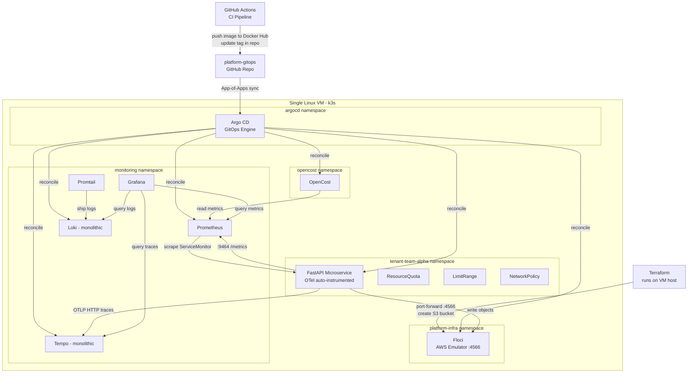

# FrugalZeus — Cloud-Native Platform Engineering & FinOps

[](https://argoproj.github.io/cd/)
[](https://www.terraform.io/)
[](https://k3s.io/)
[](https://grafana.com/)
[](https://www.opencost.io/)

> **FrugalZeus**: Sovereign platform authority with zero idle waste. A lightweight, multi-tenant Internal Developer Platform demonstrating end-to-end GitOps delivery, local cloud IaC simulation, unified OpenTelemetry observability, and sub-namespace FinOps cost attribution on a single Linux VM.

---

## Architectural Stack

| Layer | Tooling | Purpose |
| --- | --- | --- |
| **Cluster Runtime** | k3s on single Linux VM | Lightweight Kubernetes control plane and worker node. |
| **Infrastructure as Code** | Terraform | Provisions simulated AWS infrastructure (S3) against Floci. |
| **Cloud Simulation** | Floci | Low-memory AWS API emulator running inside the cluster. |
| **GitOps Engine** | Argo CD | Declarative GitOps reconciliation using the App-of-Apps pattern. |
| **CI Automation** | GitHub Actions | Builds Docker images and updates manifest tags in GitOps repo. |
| **Observability** | Prometheus + Loki + Tempo + Grafana | Metrics, logs, traces unified under OpenTelemetry. |
| **FinOps** | OpenCost | In-cluster compute cost allocation and spend attribution per namespace. |
| **Developer Portal** | MkDocs (Material) | Self-service docs hosted on GitHub Pages (zero cluster RAM). |

---

## Quick Start

```bash
# 1. Clone the repository
git clone https://github.com/<YOUR_USERNAME>/FrugalZeus.git
cd FrugalZeus

# 2. Bootstrap the entire platform
make bootstrap

# 3. Open developer port-forwards
make ports

# 4. Run endpoint smoke tests
make test
```

---

## Architecture Diagram



---

## Developer Commands

```bash
make help       # List available make commands
make bootstrap  # Install k3s, Argo CD, Floci, apply Terraform
make ports      # Port-forward Grafana, Argo CD, App, OpenCost
make status     # Show nodes, Argo CD applications, and pod status
make test       # Smoke test /health, /upload, /list, /metrics
make password   # Output Argo CD initial admin password
make clean      # Uninstall k3s completely
```
