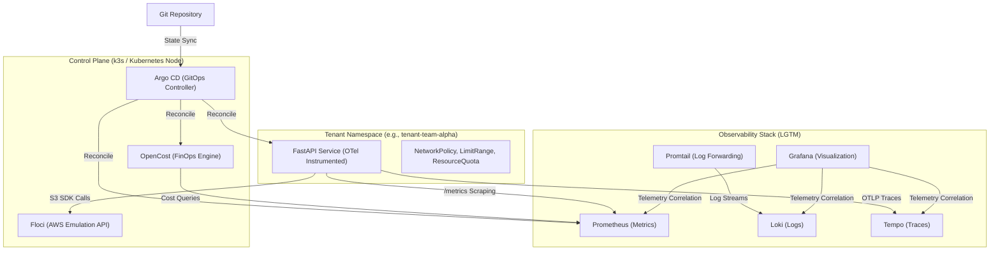

<div align="center">
    
# FrugalZeus⚜️

## Cloud-Native Engineering  Platform 

  
&nbsp;


 
</div>

**FrugalZeus** is a sovereign, zero-idle-waste Internal Developer Platform (IDP) . It demonstrates an end-to-end GitOps delivery pipeline, localized cloud IaC emulation, unified OpenTelemetry observability, and granular sub-namespace FinOps cost attribution—all orchestrated on any Kubernetes Cluster

[](https://github.com/barbaria888/FrugalZeus/actions/workflows/ci-build-push.yml)
[](https://github.com/barbaria888/FrugalZeus/actions/workflows/docs-deploy.yml)

---

## Architecture Topology

The platform enforces strict declarative state management, leveraging Argo CD's App-of-Apps pattern to synchronize infrastructure capabilities and tenant workloads.



---

## Technical Stack & Design Decisions

| Capability | Component | Architectural Justification |
| :--- | :--- | :--- |
| **Orchestration** | **k3s / Kubernetes** | Minimal footprint Kubernetes distribution; eliminates control-plane bloat for local emulation. |
| **GitOps** | **Argo CD** | Pull-based state reconciliation. Utilizes `sync-waves` for deterministic infrastructure bootstrapping before tenant workload injection. |
| **Cloud Emulation** | **Floci** | In-cluster, low-memory AWS API emulator. Allows isolated, zero-cost IaC execution (Terraform) and application SDK testing without external cloud dependencies. |
| **Observability** | **LGTM Stack** | Unified telemetry. OpenTelemetry auto-instrumentation exposes metrics (Prometheus) and traces (Tempo), correlated seamlessly in Grafana. |
| **FinOps** | **OpenCost** | Real-time, in-cluster cost allocation based on Prometheus telemetry. Enables strict showback/chargeback per tenant namespace. |
| **Tenancy** | **Kustomize** | Enforces least-privilege guardrails. Base overlays ensure immutable injection of `NetworkPolicy`, `ResourceQuota`, and `LimitRange` per tenant. |
| **Service Exposure**| **ClusterIP + Port-Forwarding** | Secure-by-default `ClusterIP` topology across all components. Local development UI access is orchestrated via verified `make ports`. |

---

## Platform Bootstrapping

The bootstrap process supports both existing Kubernetes clusters and automated k3s provisioning.

```bash
# 1. Clone the repository
git clone https://github.com/barbaria888/FrugalZeus.git
cd FrugalZeus

# 2. Execute platform orchestration
make bootstrap

# 3. Wait for all Argo CD applications to reach Synced + Healthy state
make sync-wait

# 4. Open verified developer port-forwards
# After sync, the following endpoints become available:
#   • Grafana:       http://localhost:3000  (admin / platform-admin)
#   • Argo CD:       http://localhost:8080  (admin / <make password>)
#   • Guestbook App: http://localhost:8000
#   • OpenCost:      http://localhost:9003
make ports

# 5. Print all observability endpoints and credentials
make observe

# 6. Execute validation suite
make test
```

---

## Developer Operations

```bash
make help        # Discover available automation targets
make bootstrap   # Idempotent platform instantiation (k3s/cluster, Argo CD, Floci, Terraform)
make sync-wait   # Block until all Argo CD applications reach Synced + Healthy (up to 10 min)
make ports       # Open verified local port-forwards to Grafana, Argo CD, Guestbook, and OpenCost
make observe     # Print all platform observability endpoints, datasources, and credentials
make status      # Output cluster health, Argo CD applications, services, and pod lifecycle
make test        # Smoke test guestbook, Grafana, and OpenCost endpoints (requires 'make ports')
make password    # Retrieve the Argo CD initial admin credential
make clean       # Destructive teardown of local k3s topology
```

