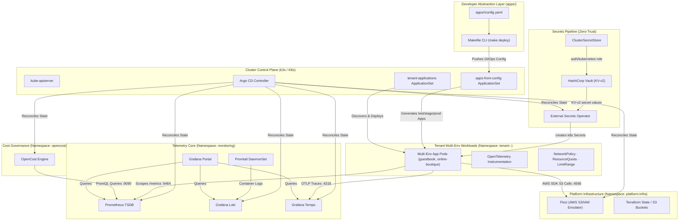
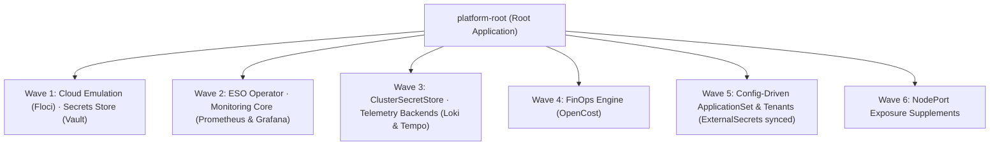
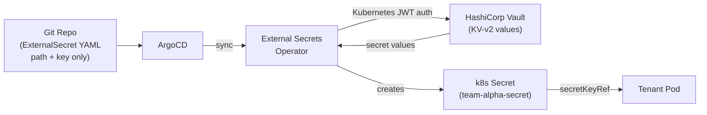
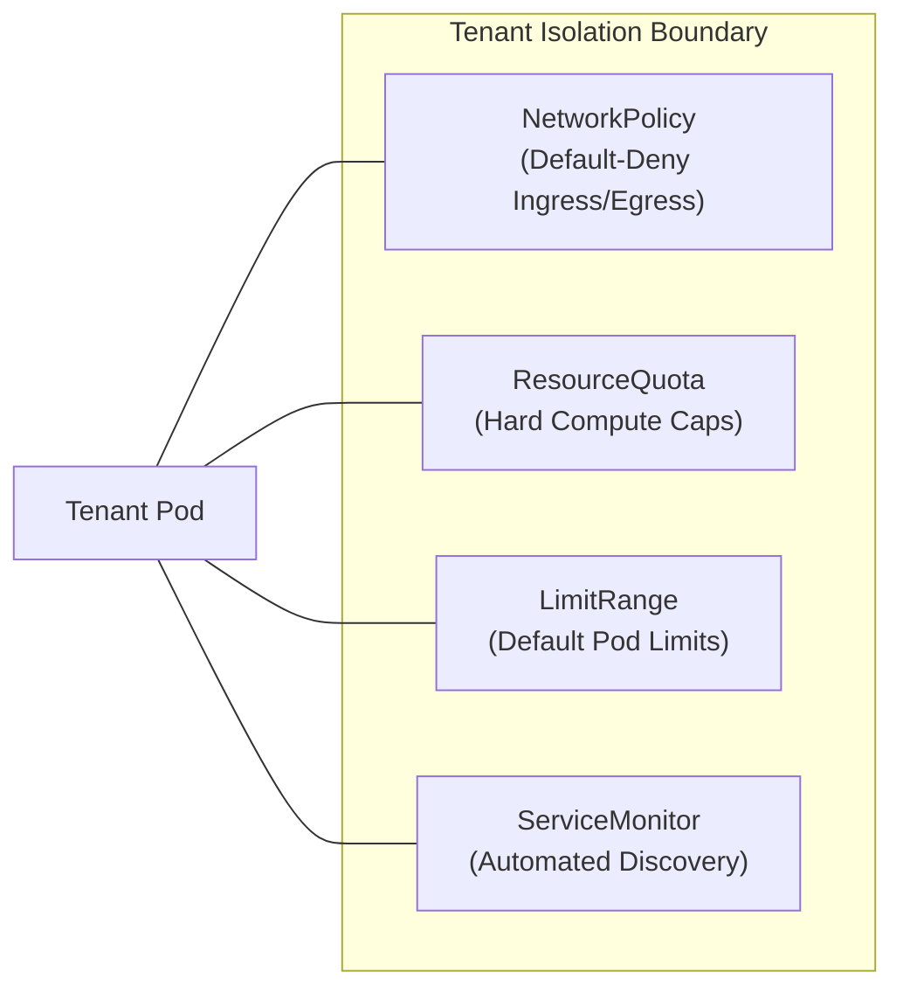
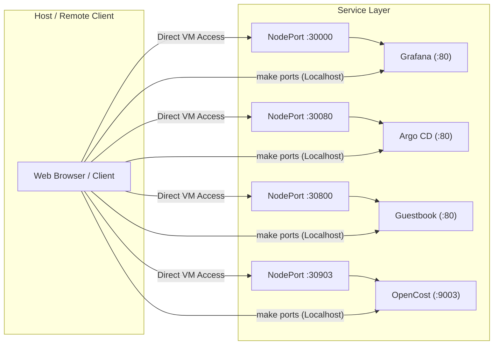

# Architecture & Technical Design

This document details the architectural blueprints, control-plane topology, and technical design decisions governing the **FrugalZeus** platform.

---

## High-Level Topology

The platform enforces strict separation of concerns across the Kubernetes control plane, developer config-driven application layer, shared infrastructure capabilities, and autonomous tenant boundaries.



---

## Declarative GitOps Architecture

FrugalZeus implements a **Two-Tier App-of-Apps and ApplicationSet** delivery model.

### 1. The App-of-Apps Pattern (`platform-root`)
The root application (`platform-gitops/root-app.yaml`) watches the repository's `platform-gitops/infrastructure/` directory. When applied, Argo CD cascades reconciliation across all shared infrastructure components, including the developer ApplicationSet.



### 2. Matrix ApplicationSet Generator (`apps-from-config.yaml`)

To shield developers from Argo CD internal manifests, the platform provides an **ApplicationSet Matrix Generator**:

```yaml
apiVersion: argoproj.io/v1alpha1
kind: ApplicationSet
metadata:
  name: apps-from-config
  namespace: argocd
  annotations:
    argocd.argoproj.io/sync-wave: "5"
spec:
  goTemplate: true
  generators:
    - matrix:
        generators:
          - git:
              repoURL: https://github.com/barbaria888/FrugalZeus.git
              revision: main
              files:
                - path: "apps/*/config.yaml"
          - list:
              elements:
                - env: test
                - env: stage
                - env: prod
  template:
    metadata:
      name: "{{ .name }}-{{ .env }}"
      namespace: argocd
      labels:
        platform.io/app: "{{ .name }}"
        platform.io/env: "{{ .env }}"
        platform.io/team: "{{ .team }}"
      annotations:
        argocd.argoproj.io/sync-wave: "5"
    spec:
      project: default
      source:
        repoURL: "{{ .source.repoURL }}"
        targetRevision: "{{ .source.targetRevision }}"
        path: "{{ .source.path }}"
      destination:
        server: https://kubernetes.default.svc
        namespace: "tenant-{{ .name }}-{{ .env }}"
      syncPolicy:
        automated:
          prune: true
          selfHeal: true
        syncOptions:
          - CreateNamespace=true
          - ServerSideApply=true
```

### 3. Deterministic Sync-Waves
To prevent race conditions during cold cluster boots, resources are ordered using the `argocd.argoproj.io/sync-wave` annotation:

| Sync Wave | Applications | Purpose & Dependencies |
| :--- | :--- | :--- |
| **Wave 1** | `floci`, `vault` | Cloud mocking layer + Vault secrets store. Vault must be up before ESO attempts auth. |
| **Wave 2** | `external-secrets`, `kube-prometheus-stack` | ESO Operator installs CRDs. Prometheus CRDs for `ServiceMonitor`. |
| **Wave 3** | `vault-config`, `loki`, `tempo` | `ClusterSecretStore` applied after ESO CRDs exist. Log and trace ingestors. |
| **Wave 4** | `opencost` | Cost engine depending on Prometheus TSDB scraping endpoints. |
| **Wave 5** | `apps-from-config`, `tenant-applications` | ExternalSecrets sync from Vault → k8s Secrets created before pods start. |
| **Wave 6** | `guestbook-nodeport` | Supplementary access overlays for external NodePort access. |

!!! tip "Server-Side Apply"
    Complex Helm charts such as `kube-prometheus-stack` contain Custom Resource Definitions (CRDs) whose schema annotations exceed the standard `kubectl.kubernetes.io/last-applied-configuration` limit (262,144 bytes). FrugalZeus enforces `ServerSideApply=true` on all Argo CD application specs to prevent deployment failures.

---

## Secrets Pipeline (Vault + ESO)

FrugalZeus uses **HashiCorp Vault OSS + External Secrets Operator** to deliver secrets to tenant workloads at runtime. No secret values are ever committed to Git.



### How it works

1. **Operator** seeds values into Vault once: `make vault-seed KEY=DB_PASSWORD VALUE=prod-pass`
2. **Git** holds an `ExternalSecret` manifest — only the Vault path and key name, never the value
3. **ArgoCD** syncs the `ExternalSecret` into the tenant namespace
4. **ESO** authenticates to Vault using its own Kubernetes ServiceAccount JWT (no static credentials)
5. **ESO** reads the value and creates a standard `k8s Secret` in the tenant namespace
6. **Tenant pod** reads the secret via `secretKeyRef` — no Vault knowledge required

### Developer workflow

```bash
# Check if secrets are synced
make vault-status

# Add or update a secret value
make vault-seed KEY=MY_SECRET VALUE=my-value

# Then add the key to external-secret.yaml in your tenant overlay and push
```

!!! note "Zero secrets in Git"
    `external-secret.yaml` contains only the Vault **path** and **key name**. Values never appear in Git history.

---

## Multi-Tenancy & Zero-Trust Isolation

Tenant isolation is implemented through immutable Kustomize overlays stamped out from `platform-gitops/tenants/base/` across all generated environment namespaces (`tenant-<app>-<env>`).



### 1. Network Microsegmentation
The platform applies a default-restricted `NetworkPolicy` to every tenant namespace:
- **Allowed Ingress**: Intra-namespace traffic, Prometheus scraper (port `9464`), and local port-forwarding proxies from `kube-system`.
- **Allowed Egress**: CoreDNS (`kube-system:53`), Kubernetes API (`default:443`), Floci S3 emulator (`platform-infra:4566`), and Tempo OTLP gateway (`monitoring:4318`).
- **Blocked**: Direct cross-tenant pod-to-pod communication is denied at the CNI layer.

### 2. Noisy-Neighbor Mitigation
- **ResourceQuotas**: Enforce maximum CPU (1-2 Cores), Memory (1-2 GiB), and Pod count (10 Pods) per namespace.
- **LimitRanges**: Automatically inject default request/limit values on pods lacking explicit declarations, ensuring predictable scheduling.

---

## Service Exposure Architecture

FrugalZeus supports both remote/VM access via **NodePorts** and local developer forwarding via **`make ports`**.



| Component | Target Namespace | Target Port | Assigned NodePort | Localhost Forward |
| :--- | :--- | :--- | :--- | :--- |
| **Grafana** | `monitoring` | `80` (HTTP) | `30000` | `http://localhost:3000` |
| **Argo CD** | `argocd` | `80` (Insecure HTTP) | `30080` | `http://localhost:8080` |
| **Tenant App** | `tenant-guestbook` | `80` (HTTP) | `30800` | `http://localhost:8000` |
| **OpenCost** | `opencost` | `9003` (HTTP) | `30903` | `http://localhost:9003` |

---

## Local Cloud Emulation (Floci)

Rather than maintaining costly external AWS resources or running heavyweight alternatives like LocalStack, FrugalZeus integrates **Floci**:
1. Microservices communicate with standard AWS SDKs using `AWS_ENDPOINT_URL=http://floci.platform-infra.svc.cluster.local:4566`.
2. Terraform manifests (`terraform/`) run against Floci during `make bootstrap` to provision buckets and IAM roles idempotently.
3. Completely sovereign: operates seamlessly in air-gapped environments or without internet access.
