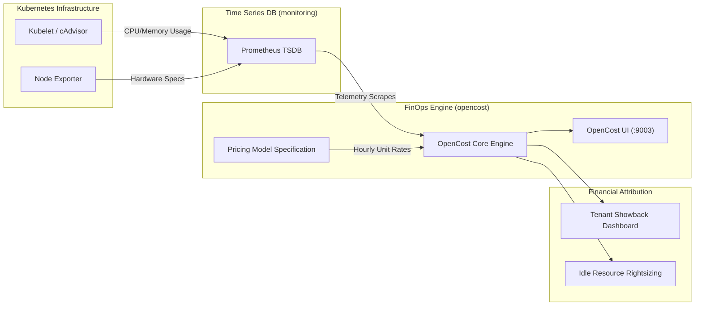
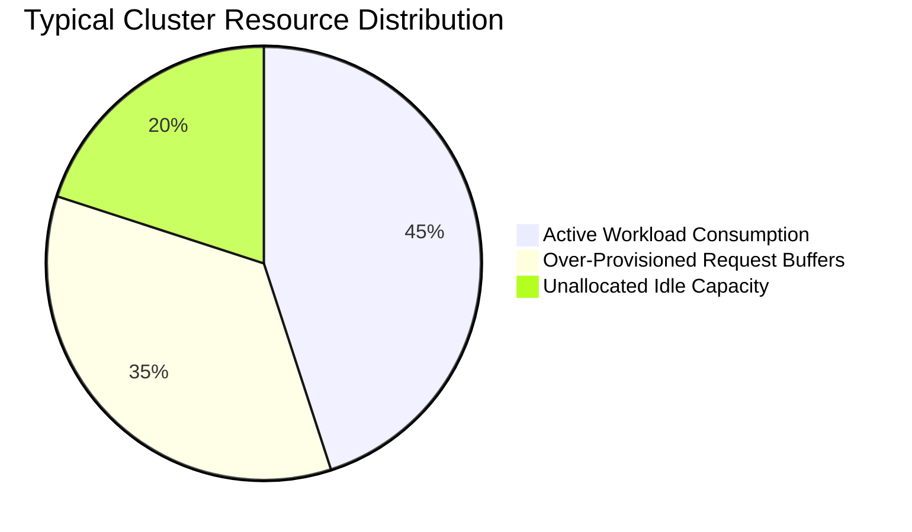

# FinOps & Kubernetes Cost Governance

This document outlines the **Financial Operations (FinOps)** framework implemented within FrugalZeus to ensure continuous, real-time cost attribution and eliminate idle infrastructure waste.

---

## FinOps Architecture & Engine Design

FrugalZeus embeds **OpenCost**, the CNCF-hosted open-source cost allocation project, directly into the platform's core infrastructure.



---

## How OpenCost Calculates Costs

OpenCost correlates low-level Kubernetes container telemetry with standard cloud or bare-metal pricing models:

$$\text{Total Pod Cost} = (\text{CPU Allocated} \times \text{CPU Rate}) + (\text{RAM Allocated} \times \text{RAM Rate}) + \text{Storage Cost} + \text{Network Cost}$$

### Telemetry Queries Used
OpenCost continuously executes PromQL queries against Prometheus:
- **CPU Allocation**: `container_cpu_usage_seconds_total` and `kube_pod_container_resource_requests{resource="cpu"}`
- **Memory Allocation**: `container_memory_working_set_bytes` and `kube_pod_container_resource_requests{resource="memory"}`
- **Node Cost Model**: Evaluates per-node CPU/RAM cost definitions to derive compute hourly rates.

---

## Multi-Tenant Cost Allocation

Costs are aggregated along Kubernetes boundary abstractions, establishing strict accountability:

| Allocation Dimension | Granularity | Platform Use Case |
| :--- | :--- | :--- |
| **Namespace** | `tenant-*`, `monitoring`, `argocd` | Top-level team showback and budget chargeback. |
| **Controller** | `Deployment`, `StatefulSet`, `DaemonSet` | Microservice-level cost unit breakdown. |
| **Pod / Container** | Individual replicas | Rightsizing memory limits and CPU requests. |
| **Label Attributions** | `team: alpha`, `cost-center: eng-101` | Cross-namespace organizational accounting. |

---

## Identifying & Mitigating Idle Waste

FrugalZeus helps engineering teams isolate the **Efficiency Gap** — the delta between what is provisioned and what is actually consumed.



### Strategic Cost Optimization Recipes

=== "Idle vs Allocated Cost Ratio"
    ```promql
    sum(node_cpu_hourly_cost) - sum(opencost_total_hourly_cost)
    ```

=== "Tenant Cost Run-Rate (Hourly)"
    ```promql
    sum(opencost_total_hourly_cost{namespace=~"tenant-.*"}) by (namespace)
    ```

=== "Over-Provisioned Memory Waste"
    ```promql
    sum(kube_pod_container_resource_requests{resource="memory"}) by (namespace)
      -
    sum(container_memory_working_set_bytes) by (namespace)
    ```

---

## Accessing the OpenCost Portal

The OpenCost web interface is pre-configured and accessible via NodePort or local forwarding:

=== "Direct NodePort Access"
    ```
    http://<NODE-IP>:30903
    ```

=== "Localhost Forwarding"
    ```bash
    make ports
    # Access at http://localhost:9003
    ```

### Key UI Features
1. **Cost Allocation View**: Drill down by Namespace, Controller, Service, or Pod with customizable time ranges (Daily, Weekly, Monthly).
2. **Efficiency Metrics**: Direct visibility into average CPU and Memory utilization percentages per tenant.
3. **Exportable Reports**: Generate CSV data for integration with internal finance systems.
