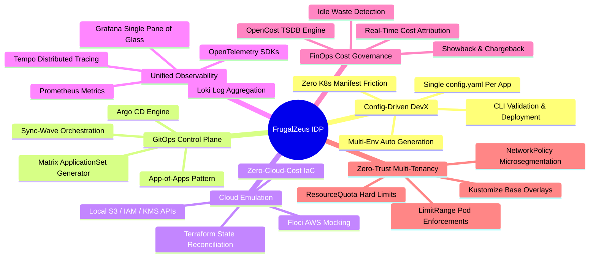

# FrugalZeus Platform Documentation

Welcome to the **FrugalZeus** Internal Developer Platform (IDP) technical documentation. FrugalZeus is an enterprise-grade, sovereign reference architecture designed to demonstrate full-lifecycle cloud-native platform engineering with zero idle financial waste.

---

## Executive Summary

Modern enterprise engineering platforms often introduce excessive cloud provider dependencies, runaway compute costs, and fractured developer workflows. **FrugalZeus** solves this by offering a **config-driven multi-environment deployment system** (`test` / `stage` / `prod`) paired with an end-to-end, declarative platform footprint that runs on any Kubernetes cluster or a single Linux virtual machine.

Developers never touch Argo CD Applications, ApplicationSets, or Kustomize internals — they edit a single `config.yaml` inside `apps/<name>/` and run simple `make` commands.

---

## Core Value Propositions

=== "Config-Driven DevX"
    Developers edit a single `config.yaml` inside `apps/<name>/` and run `make deploy APP=<name>`. An Argo CD Matrix ApplicationSet automatically creates and reconciles `test`, `stage`, and `prod` environments without developers touching complex Kubernetes or GitOps internals.

=== "Zero-Idle Waste"
    By utilizing in-cluster cloud emulation (**Floci**) and high-efficiency distributions (**k3s**), platform teams can validate complex Infrastructure-as-Code (Terraform), distributed tracing, and multi-tenant isolation without incurring cloud vendor bills or running heavyweight managed control planes.

=== "Declarative GitOps"
    Every infrastructure capability, observability component, security guardrail, and application workload is managed exclusively via **Argo CD** and **Kustomize**. The system enforces deterministic sync waves to guarantee dependency ordering on cold boots.

=== "Full-Pillar Observability"
    No fragmented monitoring tools. All metrics, logs, and distributed traces flow through **OpenTelemetry** into Prometheus, Loki, and Tempo, deeply cross-correlated inside unified **Grafana** dashboards.

=== "Granular FinOps"
    Integrated **OpenCost** maps real-time CPU and memory resource consumption directly to tenant namespaces (`tenant-<app>-<env>`), enabling automated showback and preventing noisy-neighbor budget overruns.

---

## Platform Blueprint

| Capability Pillar | Underlying Technology | Operational Role |
| :--- | :--- | :--- |
| **Developer Experience** | `apps/*/config.yaml` + `yq` Validator | Simple config-driven application onboarding & environment definitions. |
| **GitOps Matrix Engine** | Argo CD ApplicationSet | Matrix generator combining Git config files with environment lists (`test`/`stage`/`prod`). |
| **Orchestration** | Kubernetes / k3s | CNCF-conformant runtime with standard API surface. |
| **Continuous Delivery** | Argo CD | Declarative state engine leveraging App-of-Apps & ApplicationSets. |
| **Cloud Emulation** | Floci (AWS Mock) | In-cluster emulation for S3, SQS, and IAM testing without AWS accounts. |
| **IaC Automation** | Terraform / OpenTofu | Declarative infrastructure provisioning against localized endpoints. |
| **Metrics Pipeline** | Prometheus Operator | High-cardinality time-series TSDB with dynamic `ServiceMonitor` discovery. |
| **Log Management** | Grafana Loki + Promtail | Horizontal metadata-indexed log collection from container `stdout`/`stderr`. |
| **Distributed Tracing**| Grafana Tempo | High-scale trace backend accepting OTLP gRPC/HTTP payloads. |
| **Visualization** | Grafana OSS | Pre-wired dashboards with bi-directional trace-to-log-to-metric pivoting. |
| **Cost Attribution** | OpenCost | Continuous Kubernetes cost allocation and unit economics breakdown. |
| **Tenant Isolation** | Kubernetes RBAC & NetworkPolicy | Defense-in-depth isolation across compute, network, and storage. |

---

## Quick Navigation

-   :material-sitemap: **[Platform Architecture](architecture.md)**
    ---
    Explore the App-of-Apps hierarchy, Matrix ApplicationSet, sync-wave sequences, and security boundaries.

-   :material-account-plus: **[Application & Tenant Onboarding](onboarding.md)**
    ---
    Learn how development teams deploy multi-environment apps via `config.yaml` and `make` commands in minutes.

-   :material-chart-timeline-variant: **[Unified Observability](observability.md)**
    ---
    Understand OpenTelemetry instrumentation, PromQL recipes, and trace waterfalls.

-   :material-currency-usd: **[FinOps & Cost Allocation](finops.md)**
    ---
    Inspect namespace cost attribution models, Prometheus TSDB queries, and showback.

---

## System Requirements

To instantiate the complete FrugalZeus platform locally or in CI/CD:

- **Compute**: Minimum 2 vCPUs (4 vCPUs recommended)
- **Memory**: Minimum 4 GB RAM (8 GB recommended for full LGTM stack)
- **Disk**: 20 GB available storage
- **Operating System**: Linux (Ubuntu 22.04+, Debian 12+, RHEL 9+) or WSL2
- **Tools**: `kubectl`, `make`, `curl`, `git`, `yq` (or `python`)
