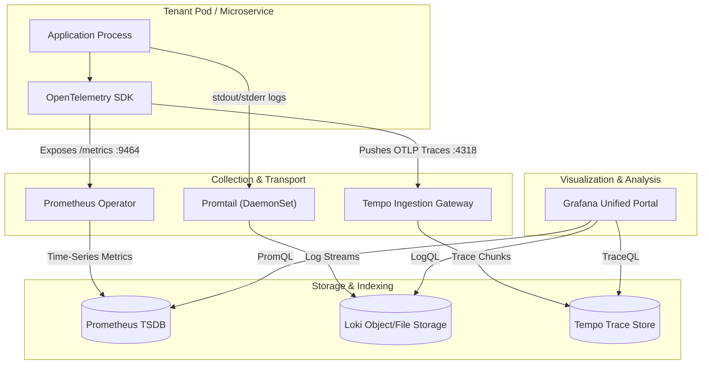
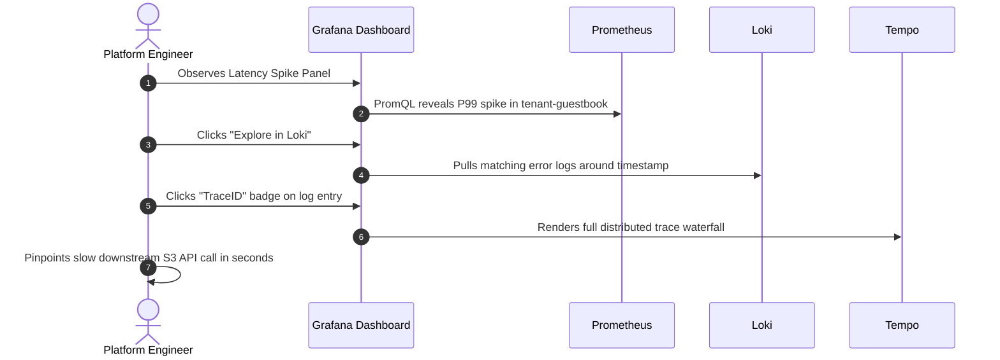

# Unified Observability Strategy

The FrugalZeus platform implements the **LGTM** (Loki, Grafana, Tempo, Metrics/Prometheus) observability stack, unified by **OpenTelemetry (OTel)** open standards. This eliminates telemetry silos and allows instant correlation across the three pillars of observability.

---

## Observability Architecture



---

## 1. Metrics Pipeline (Prometheus)

Prometheus is deployed via the `kube-prometheus-stack` Helm chart, operating in an automated operator pattern.

### Dynamic Service Discovery
Instead of manual scrape configs, tenant services declare a `ServiceMonitor` resource. The Prometheus Operator automatically matches any service labeled with `platform.io/tenant: "true"`:

```yaml
apiVersion: monitoring.coreos.com/v1
kind: ServiceMonitor
metadata:
  name: tenant-metrics
  namespace: tenant-guestbook
spec:
  selector:
    matchLabels:
      platform.io/tenant: "true"
  endpoints:
    - port: metrics
      path: /metrics
      interval: 15s
```

### Essential PromQL Queries

=== "Request Latency (P99)"
    ```promql
    histogram_quantile(
      0.99,
      sum(rate(http_server_request_duration_seconds_bucket{namespace=~"tenant-.*"}[5m])) by (le, service_name)
    )
    ```

=== "Error Rate (HTTP 5xx)"
    ```promql
    sum(rate(http_requests_total{status=~"5..", namespace=~"tenant-.*"}[5m]))
      /
    sum(rate(http_requests_total{namespace=~"tenant-.*"}[5m])) * 100
    ```

=== "Memory Working Set vs Limits"
    ```promql
    sum(container_memory_working_set_bytes{container!=""}) by (namespace, pod)
      /
    sum(kube_pod_container_resource_limits{resource="memory"}) by (namespace, pod) * 100
    ```

---

## 2. Distributed Tracing (Tempo)

Tempo provides high-throughput, low-cost distributed tracing backend without requiring external databases.

### OpenTelemetry Configuration
Microservices leverage standard OpenTelemetry auto-instrumentation or SDKs. Traces are emitted over HTTP/OTLP directly into Tempo:

```yaml
env:
  - name: OTEL_SERVICE_NAME
    value: "guestbook-service"
  - name: OTEL_TRACES_EXPORTER
    value: "otlp"
  - name: OTEL_EXPORTER_OTLP_ENDPOINT
    value: "http://tempo.monitoring.svc.cluster.local:4318"
```

### Trace Waterfall Capabilities
Inside Grafana, distributed traces break down spans into:
- Intra-process function execution times.
- Downstream database/Redis latency.
- Floci S3 API network roundtrips.

---

## 3. Log Aggregation (Loki)

Loki operates on a lightweight metadata-indexing design. Rather than indexing the entire log text, Loki indexes container metadata labels and formats logs dynamically at query time.

### Log Enrichment Pipeline
Promtail automatically attaches standard Kubernetes metadata:
- `namespace`: The tenant namespace (e.g. `tenant-guestbook`)
- `pod`: Pod name and replica UID
- `container`: Container runtime identifier

### Essential LogQL Queries

=== "Stream Logs by Namespace"
    ```logql
    {namespace="tenant-guestbook"} |= "error"
    ```

=== "JSON Log Parsing & Rate"
    ```logql
    sum(rate({namespace=~"tenant-.*"} | json | status >= 500 [5m])) by (app)
    ```

=== "Trace ID Extraction from Logs"
    ```logql
    {namespace=~"tenant-.*"} | json | line_format "TraceID={{.trace_id}} Level={{.level}} Msg={{.message}}"
    ```

---

## 4. The Unified Correlation Workflow

Grafana integrates Prometheus, Loki, and Tempo with seamless bi-directional links:



---

## Pre-Configured Dashboards

Grafana is provisioned with out-of-the-box dashboards via sidecar discovery:

1. **Compute Resources / Namespace**: Visualizes CPU/Memory quotas, requests, limits, and throttles.
2. **Compute Resources / Pod**: Drill down into container restarts, OOM kills, and network I/O.
3. **Node Exporter / Full**: Low-level Linux kernel metrics, disk I/O, and CPU core utilization.
4. **Tenant Service Overview**: Application-level RED metrics (Rate, Errors, Duration).
