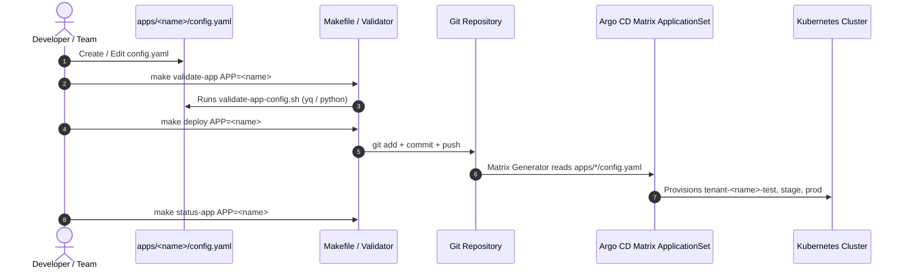

# Application & Tenant Onboarding

This document provides the definitive guide for onboarding new engineering teams, microservices, and applications onto the **FrugalZeus** platform.

The platform provides a **simple, developer-friendly, config-driven multi-environment application deployment system** (`test` / `stage` / `prod`). Developers **never** touch Argo CD Application manifests, ApplicationSets, Kustomize bases, or GitOps internals. They only edit a single `config.yaml` inside `apps/<name>/` and run standard `make` commands.

---

## Developer Onboarding Architecture



---

##  Quick-Start: Onboard a Microservice in 4 Steps

Follow these minimal, clear steps (inspired by Google's microservices demo guidelines) to deploy your service across `test`, `stage`, and `prod` environments.

### 1. Create a Directory for Your App

Create a directory named after your application inside the `apps/` root directory:

```bash
mkdir -p apps/my-service
```

### 2. Create `config.yaml`

Create `apps/my-service/config.yaml` defining your repository source and environments:

```yaml
name: my-service
team: checkout-squad

source:
  repoURL: https://github.com/my-org/my-service.git
  path: deploy/k8s
  targetRevision: main

environments:
  test:
    enabled: true
    replicas: 1
  stage:
    enabled: true
    replicas: 2
  prod:
    enabled: true
    replicas: 3
```

### 3. Validate Configuration

Run the local validation script via `make`:

```bash
make validate-app APP=my-service
```

*Output:*
```text
Validating application config: apps/my-service/config.yaml
  [OK] App name: my-service
  [OK] Source repo: https://github.com/my-org/my-service.git
  [OK] Source path: deploy/k8s
  [OK] Enabled environments found: 3 (test, stage, prod)
[OK] Validation passed for apps/my-service/config.yaml
```

### 4. Deploy via GitOps

Commit and push your application configuration to trigger Argo CD dynamic provisioning:

```bash
make deploy APP=my-service
```

Argo CD's `apps-from-config` ApplicationSet automatically generates three environment Applications in isolated namespaces:
- `tenant-my-service-test`
- `tenant-my-service-stage`
- `tenant-my-service-prod`

---

## Application Operations & Lifecycle Commands

| Target | Command | Description |
| :--- | :--- | :--- |
| **List Apps** | `make apps` | Lists all onboarded application configs under `apps/` |
| **Validate** | `make validate-app APP=<name>` | Validates YAML fields (`.name`, `.source.repoURL`, `.source.path`, `.environments`) |
| **Deploy** | `make deploy APP=<name>` | Validates, commits, and pushes app config to trigger GitOps sync |
| **Promote** | `make promote APP=<name> FROM=test TO=prod` | Displays environment promotion guidance and steps |
| **Status** | `make status-app APP=<name>` | Checks Argo CD sync state across `test`, `stage`, and `prod` |
| **Destroy** | `make destroy APP=<name>` | Deletes app directory from Git; Argo CD automatically prunes cluster resources |

---

## Production-Ready Application Config Examples

### Example 1: `guestbook` (`apps/guestbook/config.yaml`)

```yaml
name: guestbook
team: platform-demo

source:
  repoURL: https://github.com/argoproj/argocd-example-apps.git
  path: guestbook
  targetRevision: HEAD

environments:
  test:
    enabled: true
    replicas: 1
  stage:
    enabled: true
    replicas: 2
  prod:
    enabled: true
    replicas: 3
```

### Example 2: `online-boutique` (`apps/online-boutique/config.yaml`)

```yaml
name: online-boutique
team: platform-demo

source:
  repoURL: https://github.com/GoogleCloudPlatform/microservices-demo.git
  path: kustomize
  targetRevision: main

environments:
  test:
    enabled: true
  stage:
    enabled: true
  prod:
    enabled: true
```

---

## Under the Hood: Matrix ApplicationSet (`apps-from-config.yaml`)

Platform engineers maintain the underlying Matrix ApplicationSet (`platform-gitops/infrastructure/apps-from-config.yaml`). Developers **never** edit this file.

```yaml
apiVersion: argoproj.io/v1alpha1
kind: ApplicationSet
metadata:
  name: apps-from-config
  namespace: argocd
  annotations:
    argocd.argoproj.io/sync-wave: "5"
spec:
  goTemplate: true
  generators:
    - matrix:
        generators:
          - git:
              repoURL: https://github.com/barbaria888/FrugalZeus.git
              revision: main
              files:
                - path: "apps/*/config.yaml"
          - list:
              elements:
                - env: test
                - env: stage
                - env: prod
  template:
    metadata:
      name: "{{ .name }}-{{ .env }}"
      namespace: argocd
      labels:
        platform.io/app: "{{ .name }}"
        platform.io/env: "{{ .env }}"
        platform.io/team: "{{ .team }}"
      annotations:
        argocd.argoproj.io/sync-wave: "5"
    spec:
      project: default
      source:
        repoURL: "{{ .source.repoURL }}"
        targetRevision: "{{ .source.targetRevision }}"
        path: "{{ .source.path }}"
      destination:
        server: https://kubernetes.default.svc
        namespace: "tenant-{{ .name }}-{{ .env }}"
      syncPolicy:
        automated:
          prune: true
          selfHeal: true
        syncOptions:
          - CreateNamespace=true
          - ServerSideApply=true
```

---

## Tenant Infrastructure Baseline Overlays (`tenants/base/`)

For advanced platform extensions or custom tenant guardrails, every tenant namespace (`tenant-<name>-<env>`) inherits security and operational guardrails from `platform-gitops/tenants/base/`:

| Guardrail Manifest | Purpose |
| :--- | :--- |
| `namespace.yaml` | Applies `platform.io/tenant: "true"` label for platform observability scraping. |
| `resource-quota.yaml` | Prevents runaway compute costs and cluster starvation. |
| `limit-range.yaml` | Injects default requests & limits per container. |
| `network-policy.yaml` | Enforces default-deny microsegmentation with whitelisted telemetry ports. |
| `service-monitor.yaml` | Automatically scrapes metrics on port `metrics` every 15 seconds. |

---

## Day-2 Verification & Operations

Once deployed via `make deploy APP=<name>`, verify service health:

=== "1. Check GitOps Health"
    ```bash
    make status-app APP=my-service
    ```

=== "2. Verify Metrics in Grafana"
    1. Open Grafana at `http://<NODE-IP>:30000` (or `http://localhost:3000`).
    2. Open **Dashboards > Kubernetes / Compute Resources / Namespace**.
    3. Select `tenant-my-service-test` or `tenant-my-service-prod`.

=== "3. Check Logs in Loki"
    1. In Grafana, open **Explore > Loki**.
    2. Run query: `{namespace="tenant-my-service-prod"}`.

=== "4. Inspect Cost in OpenCost"
    1. Open OpenCost at `http://<NODE-IP>:30903` (or `http://localhost:9003`).
    2. Select **Cost Allocation** and group by `Namespace`.
    3. Confirm `tenant-my-service-prod` appears with real-time cost attribution.

---

## Troubleshooting Guide

| Issue | Root Cause | Remediation |
| :--- | :--- | :--- |
| **Validation Failed: `.name` missing** | `config.yaml` is missing required fields. | Ensure `.name`, `.source.repoURL`, `.source.path`, and `.environments` are present. |
| **Argo CD App Not Generated** | Config not committed or pushed to `main`. | Run `make deploy APP=<name>` to commit and push changes. |
| **`yq` Not Found Error** | `yq` CLI binary not installed locally. | Install `yq` or fallback to `python` (which auto-validates PyYAML). |
| **Pod in `CrashLoopBackOff`** | Memory/CPU limits exceeded. | Inspect pod logs and adjust `ResourceQuota` / container requests. |
