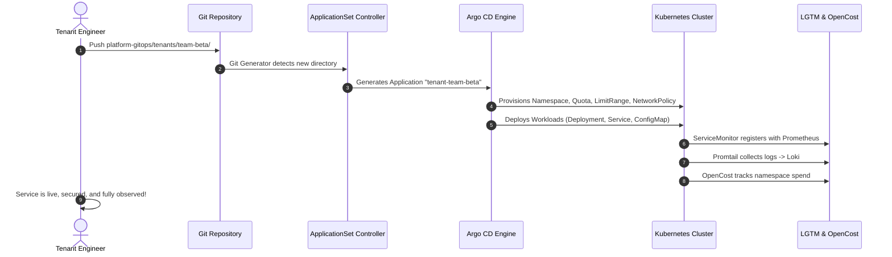

# Golden Path Tenant Onboarding

This document provides the definitive guide for onboarding new engineering teams and microservices onto the **FrugalZeus** platform. The process follows a strict GitOps contract powered by Argo CD **ApplicationSets** and immutable **Kustomize** overlays.

---

## Onboarding Architecture

When onboarding a new tenant (e.g., `team-beta`), platform engineers do not manually execute `kubectl apply` commands. Instead, committing a tenant directory to Git automatically triggers the full provisioning lifecycle.



---

## The Tenant Baseline Overlay (`tenants/base/`)

Every tenant inherits foundational security and operational guardrails from `platform-gitops/tenants/base/`:

| Guardrail Manifest | Enforcement Mechanism | Purpose |
| :--- | :--- | :--- |
| `namespace.yaml` | `platform.io/tenant: "true"` label | Enables automated scraping and tenant filtering. |
| `resource-quota.yaml` | CPU (1-2 Cores), RAM (1-2 GiB), Pods (10) | Prevents runaway costs and cluster starvation. |
| `limit-range.yaml` | Default requests & limits per container | Guarantees predictable scheduling for unconfigured pods. |
| `network-policy.yaml` | Default-deny with explicit ingress/egress rules | Prevents lateral cross-tenant communication. |
| `service-monitor.yaml` | Scrapes port `metrics` every 15s | Automatic Prometheus integration without config files. |

---

## Step-by-Step Onboarding Walkthrough

Follow these steps to instantiate a new tenant environment (e.g. `team-beta`):

### 1. Copy the Verified Tenant Template

```bash
cp -r platform-gitops/tenants/team-alpha platform-gitops/tenants/team-beta
```

### 2. Configure Tenant Overlays

Edit `platform-gitops/tenants/team-beta/kustomization.yaml`:

```yaml
apiVersion: kustomize.config.k8s.io/v1beta1
kind: Kustomization
namespace: tenant-team-beta

resources:
  - ../base
  - deployment.yaml
  - service.yaml
  - configmap.yaml

commonLabels:
  team: beta
  platform.io/tenant: "true"
```

### 3. Customize Application Workload

Update `platform-gitops/tenants/team-beta/deployment.yaml` with your container image and OTel configuration:

```yaml
apiVersion: apps/v1
kind: Deployment
metadata:
  name: team-beta-svc
spec:
  replicas: 1
  selector:
    matchLabels:
      app: team-beta-svc
  template:
    metadata:
      labels:
        app: team-beta-svc
        platform.io/tenant: "true"
    spec:
      containers:
        - name: microservice
          image: your-org/team-beta-svc:latest
          ports:
            - containerPort: 8000
              name: http
            - containerPort: 9464
              name: metrics
          env:
            - name: OTEL_SERVICE_NAME
              value: "team-beta-svc"
            - name: OTEL_EXPORTER_OTLP_ENDPOINT
              value: "http://tempo.monitoring.svc.cluster.local:4318"
```

### 4. Dynamic Discovery via ApplicationSet

The platform's `tenant-applications` ApplicationSet (`platform-gitops/infrastructure/tenants-applicationset.yaml`) uses a Git directory generator to discover the new tenant automatically:

```yaml
apiVersion: argoproj.io/v1alpha1
kind: ApplicationSet
metadata:
  name: tenant-applications
  namespace: argocd
spec:
  generators:
    - git:
        repoURL: https://github.com/barbaria888/FrugalZeus.git
        revision: main
        directories:
          - path: platform-gitops/tenants/*
          - path: platform-gitops/tenants/base
            exclude: true
  template:
    metadata:
      name: 'tenant-{{path.basename}}'
      namespace: argocd
    spec:
      destination:
        server: https://kubernetes.default.svc
        namespace: 'tenant-{{path.basename}}'
```

### 5. Commit & Reconcile

```bash
git add platform-gitops/tenants/team-beta/
git commit -m "feat(tenants): onboard team-beta microservice"
git push origin main
```

---

## Day-2 Tenant Verification

Once committed, verify that the new tenant is fully operational across all platform pillars:

=== "1. Check GitOps Health"
    ```bash
    make sync-wait
    # Verify 'tenant-team-beta' application is Synced & Healthy
    ```

=== "2. Verify Metrics in Grafana"
    1. Navigate to Grafana at `http://<NODE-IP>:30000` (or `http://localhost:3000`).
    2. Open **Dashboards > Kubernetes / Compute Resources / Namespace**.
    3. Select `tenant-team-beta` from the dropdown.

=== "3. Check Logs in Loki"
    1. In Grafana, navigate to **Explore > Loki**.
    2. Run query: `{namespace="tenant-team-beta"}`.

=== "4. Inspect Cost in OpenCost"
    1. Open OpenCost at `http://<NODE-IP>:30903` (or `http://localhost:9003`).
    2. Select **Cost Allocation** and group by `Namespace`.
    3. Confirm `tenant-team-beta` appears with real-time hourly cost attribution.

---

## Troubleshooting Guide

| Issue | Root Cause | Remediation |
| :--- | :--- | :--- |
| **Argo CD App Not Generated** | Missing or misnamed directory in Git. | Ensure directory matches `platform-gitops/tenants/<tenant-name>` and changes are pushed to `main`. |
| **Pod in `CrashLoopBackOff`** | Memory limit exceeded. | Check `ResourceQuota` / `LimitRange` allocations with `kubectl describe quota -n <namespace>`. |
| **Prometheus Not Scraping** | Missing label or port name. | Verify Service has label `platform.io/tenant: "true"` and port is named `metrics`. |
| **Traces Not Appearing in Tempo** | Incorrect OTLP endpoint. | Ensure `OTEL_EXPORTER_OTLP_ENDPOINT` is set to `http://tempo.monitoring.svc.cluster.local:4318`. |
| **Network Egress Blocked** | Destination outside NetworkPolicy. | Inspect `platform-gitops/tenants/base/network-policy.yaml` to ensure required egress CIDRs or namespaces are whitelisted. |
